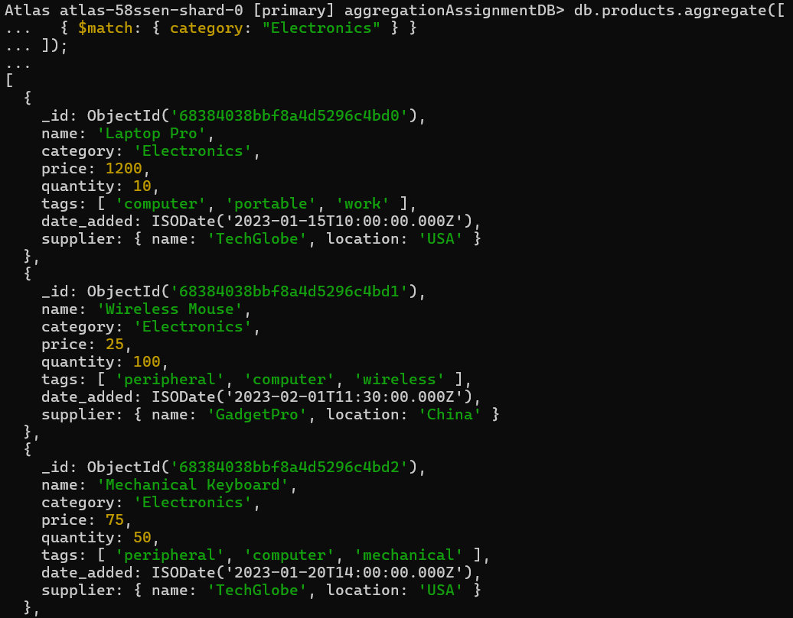

# MongoDB-Assignment-02:

This repository contains MongoDB aggregation queries executed on a `products` collection. The queries are categorized by difficulty and include screenshots of output for verification.

## 📂 Project Structure

```
├── queries/
│   ├── easy.js
│   ├── medium.js
│   └── hard.js
├── screenshots/
│   ├── easy\1.png
│   ├── easy\2.png
│   ├── easy\3.png
│   ├── medium\1.png
│   ├── medium\2.png
│   ├── medium\3.png
│   ├── hard\1.png
│   ├── hard\2.png
│   └── hard\3.png
└── README.md
```

---

## ✅ Easy Level

### 1. Products in the "Electronics" Category

```js
db.products.aggregate([
  { $match: { category: "Electronics" } }
]);
```



---

### 2. Count Products per Category

```js
db.products.aggregate([
  {
    $group: {
      _id: "$category",
      count: { $sum: 1 }
    }
  }
]);
```


---

### 3. Product Names and Prices (Descending by Price)

```js
db.products.aggregate([
  {
    $project: {
      _id: 0,
      name: 1,
      price: 1
    }
  },
  {
    $sort: { price: -1 }
  }
]);
```


---

## ✅ Medium Level

### 1. Total Quantity by Supplier

```js
db.products.aggregate([
  {
    $group: {
      _id: "$supplier.name",
      totalQuantity: { $sum: "$quantity" }
    }
  }
]);
```


---

### 2. Average Price by Tag

```js
db.products.aggregate([
  { $unwind: "$tags" },
  {
    $group: {
      _id: "$tags",
      averagePrice: { $avg: "$price" }
    }
  },
  {
    $sort: { averagePrice: -1 }
  }
]);
```


---

### 3. Products Added in February 2023

```js
db.products.aggregate([
  {
    $match: {
      date_added: {
        $gte: ISODate("2023-02-01T00:00:00Z"),
        $lt: ISODate("2023-03-01T00:00:00Z")
      }
    }
  },
  {
    $project: {
      _id: 0,
      name: 1,
      category: 1,
      formattedDateAdded: {
        $dateToString: {
          format: "%Y-%m-%d",
          date: "$date_added"
        }
      }
    }
  }
]);
```


---

## ✅ Hard Level

### 1. Category Value and Classification

```js
db.products.aggregate([
  {
    $group: {
      _id: "$category",
      totalInventoryValue: {
        $sum: { $multiply: ["$price", "$quantity"] }
      }
    }
  },
  {
    $project: {
      categoryName: "$_id",
      totalInventoryValue: 1,
      valueClassification: {
        $switch: {
          branches: [
            {
              case: { $gt: ["$totalInventoryValue", 10000] },
              then: "High Value"
            },
            {
              case: { $gt: ["$totalInventoryValue", 5000] },
              then: "Medium Value"
            }
          ],
          default: "Standard Value"
        }
      }
    }
  }
]);
```


---

### 2. Supplier with Most Expensive Product

```js
db.products.aggregate([
  {
    $sort: { price: -1 }
  },
  {
    $group: {
      _id: "$supplier.name",
      mostExpensiveProductName: { $first: "$name" },
      maxPrice: { $first: "$price" }
    }
  },
  {
    $project: {
      _id: 0,
      supplierName: "$_id",
      mostExpensiveProductName: 1,
      maxPrice: 1
    }
  }
]);
```


---

### 3. Products Tagged "Portable" but NOT "Computer"

```js
db.products.aggregate([
  {
    $match: {
      tags: { $in: ["portable"], $nin: ["computer"] }
    }
  },
  {
    $project: {
      _id: 0,
      name: 1,
      tags: 1
    }
  }
]);
```


---

## 🛠️ Requirements

* MongoDB v5 or above
* Mongo Shell or Compass
* Sample dataset with `products` collection and fields: `name`, `category`, `price`, `quantity`, `tags`, `supplier`, `date_added`

---
